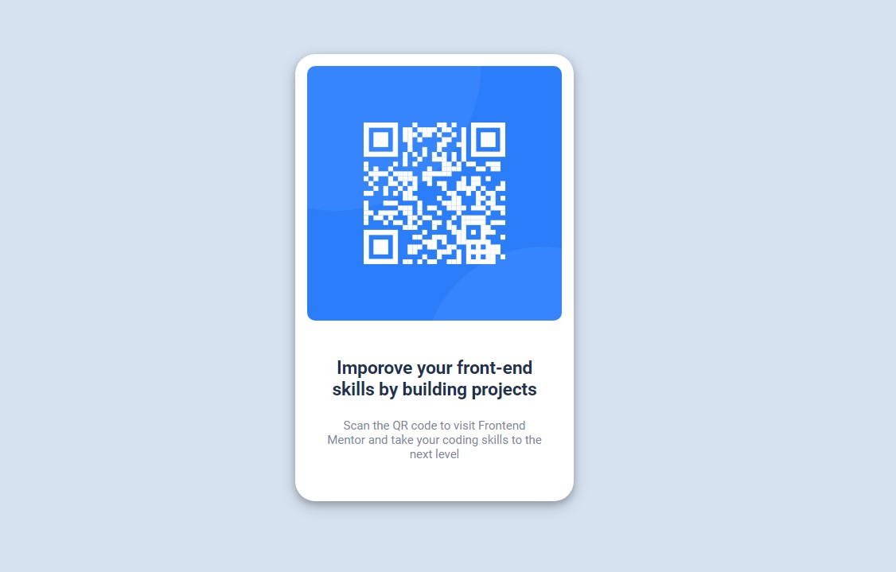

# Frontend Mentor - QR code component

## Merhaba! 👋
[Frontend Mentor](https://www.frontendmentor.io) challenglar, gerçekçi projeler oluşturarak kodlama becerilerinizi geliştirmenize yardımcı olur.

## Frontend Mentor Challange
Buradaki zorluk, bu QR kod bileşenini oluşturmak ve tasarıma mümkün olduğunca yakın görünmesini sağlamaktır.

### Ekran Görüntüsü

### Öğrendiklerim
Benim için .Container ve .card divlerini oluşturmak zorlayıcı oldu fakat sonunda kullandığım css kodları ile iyi bir iş çıkardığıma inanıyorum.
